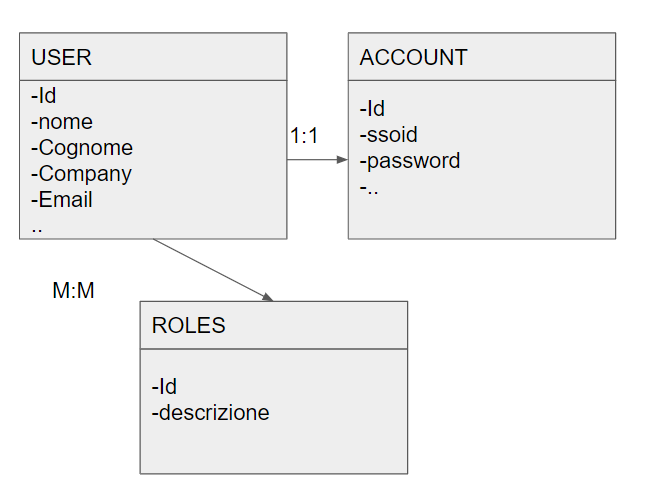

# auth

Applicazione spring boot che permette di registrare e di gestire jwt authentication 
insieme ad un filtro di authorization per ogni richiesta effettuata.

## tecnology

- Spring boot v. 2.4.3
- spring jpa
- lombok
- spring web
- support sqlite
- support postgres
- support mySQL

## librerie utilizzate
```
		<!--jpa -->
		<dependency>
			<groupId>org.springframework.boot</groupId>
			<artifactId>spring-boot-starter-data-jpa</artifactId>
		</dependency>
		<!--security -->
		<dependency>
			<groupId>org.springframework.boot</groupId>
			<artifactId>spring-boot-starter-security</artifactId>
		</dependency>
		<!--web -->
		<dependency>
			<groupId>org.springframework.boot</groupId>
			<artifactId>spring-boot-starter-web</artifactId>
		</dependency>
		<!--reload -->
		<dependency>
			<groupId>org.springframework.boot</groupId>
			<artifactId>spring-boot-devtools</artifactId>
			<scope>runtime</scope>
			<optional>true</optional>
		</dependency>
		<!--h2 -->
		<dependency>
			<groupId>com.h2database</groupId>
			<artifactId>h2</artifactId>
			<scope>runtime</scope>
		</dependency>
		<!--test -->
		<dependency>
			<groupId>org.springframework.boot</groupId>
			<artifactId>spring-boot-starter-test</artifactId>
			<scope>test</scope>
		</dependency>
		<dependency>
			<groupId>org.springframework.security</groupId>
			<artifactId>spring-security-test</artifactId>
			<scope>test</scope>
		</dependency>
		<!--jwt -->
		<dependency>
			<groupId>io.jsonwebtoken</groupId>
			<artifactId>jjwt-api</artifactId>
			<version>0.11.2</version>
		</dependency>
		<dependency>
			<groupId>io.jsonwebtoken</groupId>
			<artifactId>jjwt-impl</artifactId>
			<version>0.11.2</version>
			<scope>runtime</scope>
		</dependency>
		<dependency>
			<groupId>io.jsonwebtoken</groupId>
			<artifactId>jjwt-jackson</artifactId> <!-- or jjwt-gson if Gson is preferred -->
			<version>0.11.2</version>
			<scope>runtime</scope>
		</dependency>
		<!-- junit di test -->
		<dependency>
			<groupId>junit</groupId>
			<artifactId>junit</artifactId>
			<scope>test</scope>
		</dependency>
```
## Database Supported

- MySQL
- SQLite
- PostgreSQL

## Data Model

The Auth data model represents a digital media store, including tables for User, Account, Roles and JWT token generation.

## How do I Download and Create the Auth Database?

Download the repository, compile and launch in intellij or eclipse or visualstudio code.
After installation run the command

```
mvn clean install
java -jar .\target\auth-0.0.1-SNAPSHOT.jar --server.port=8080 --spring.profiles.active=sqlite
```

## active profiles

- sqlite
- mysql
- postgres

An embedded database, SQLite and SQL Server Compact, it is also provided the embedded database in src/main/resourse/Auth.db

Notes:

## MySQL

- Tested with MySQL server comunity v. 8.0.0.1

## Postgres

- Tested with Postgres v 13.2

## SQLite

- Tested with SQLite 3.25.2

## Development

### System Requirements

- Intellij comunity edition
- Eclipse
- Visual Studio Code
- MySql V8.0.1
- Postgres v 13.2
- Sqlite v 3.25.2

## database: ER



## Install postman for Rest Services

import the collection in postman

[AuthJpa.postman_collection](auth.postman_collection.json)

## License

[MIT](https://choosealicense.com/licenses/mit/)